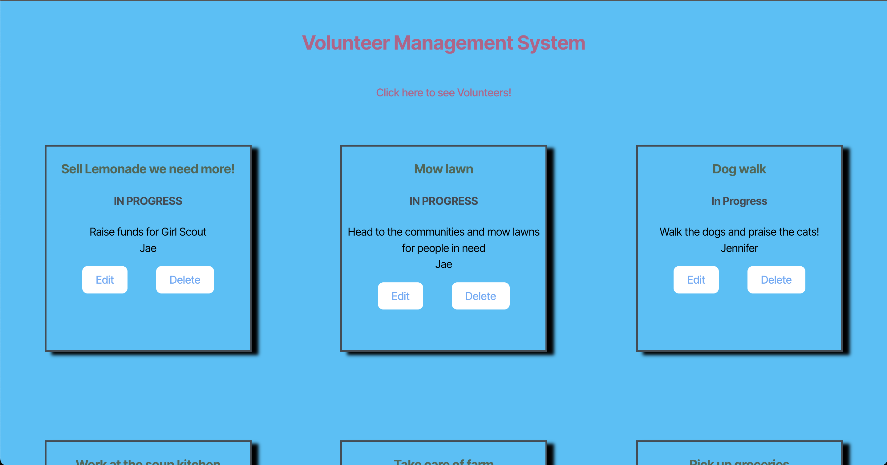
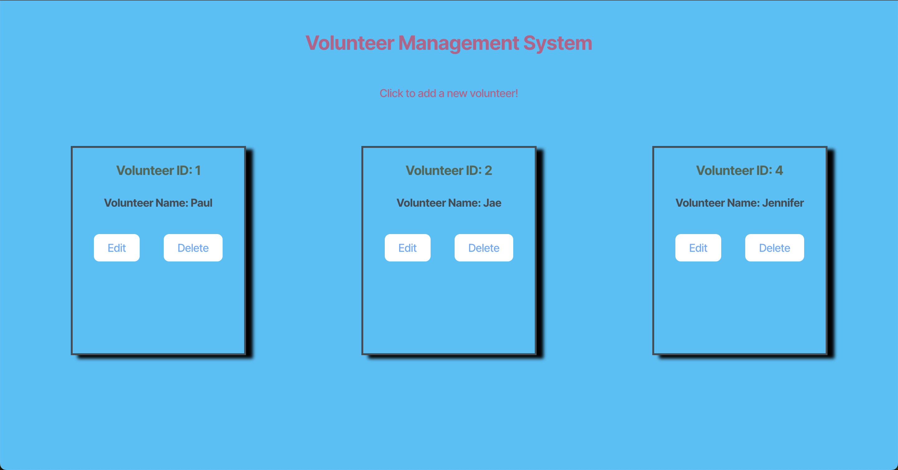
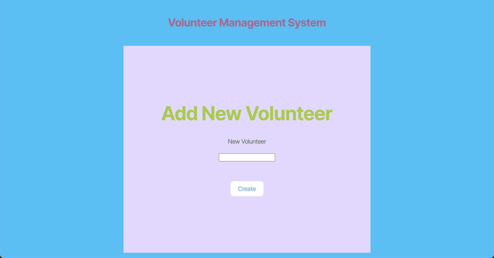
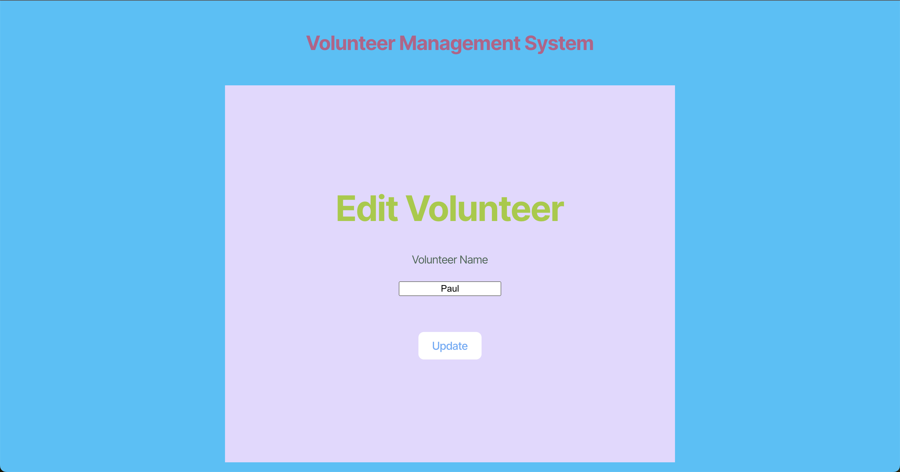
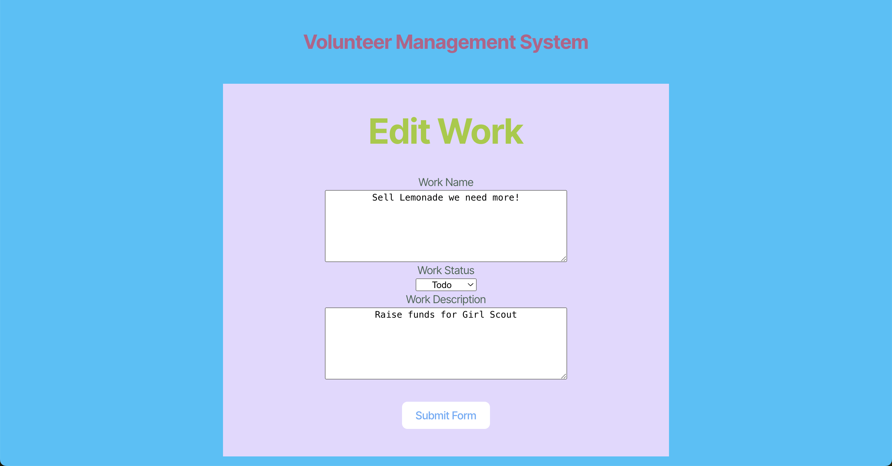

# Volunteer Management System

## Project Overview

The Volunteer Management System is a full-stack CRUD (Create, Read, Update, Delete) application designed to help volunteer organizers efficiently manage volunteers and their assigned tasks. This system leverages Sequelize ORM (Object-Relational Mapping) to interact with a relational database, ensuring robust data management. The backend is built with Express.js, while the frontend is developed using React, providing a seamless and responsive user experience.

The application addresses the challenge of organizing and tracking volunteer activities by allowing users to store, update, and retrieve information about volunteers and their assigned tasks. The system establishes a one-to-many relationship between volunteers and tasks, enabling organizers to assign multiple tasks to a single volunteer. This structure ensures data integrity and simplifies the management of volunteer workloads.

Key functionalities include adding new volunteers, updating volunteer details, assigning tasks, and tracking task progress. The system is designed to be intuitive and user-friendly, making it an ideal tool for organizations that rely on volunteer contributions.

## Table of Contents

- [Usage](#usage)
- [Mock-Up](#mock-up)
- [Instructions](#instructions)
- [Key Features](#key-features)
- [Technology Stack](#technology-stack)
- [Additional Resources](#additional-resources)

## Usage

To set up and run the application locally, follow these steps:

1. Install Dependencies
```bash
npm install
```

2. Create a `.env` file in the server directory using the provided `.env.EXAMPLE` file and update the database connection details.

3. Populate the database with initial data:
```bash
npm run seed
```

4. Run both the server and client side simultaneously:
```bash
npm run start:dev
```

5. To install dependencies, seed the database, and build the project all at once, run:
```bash
npm run dev
```

## Mock-Up

The following images show the web application's appearance and functionality:

Displays a list of volunteer jobs, their progress, and assigned volunteers:



Shows all registered volunteers:



Allows adding a new volunteer to the database:



Enables editing a volunteer's information:



Allows updating details of assigned volunteer jobs:



## Instructions

1. Clone the repository:
```bash
git clone git@github.com:gilmerperez/volunteer-management-system.git
```

2. Navigate into the project directory:
```bash
cd volunteer-management-system
```

3. Follow the Usage section for installation and setup.

4. Ensure the database is configured correctly.

5. Start the development server using `npm run start:dev`.

## Key Features

- **React-Based UI:** Ensures a modern, dynamic user experience.
- **Express API Routing:** Organize films into "Seen It" and "Watch" lists.
- **Database Integration:** Save and retrieve movies from `localStorage`.
- **One-to-Many Relationship:** Remove movies from lists with a single click.
- **Volunteer & Work Management:** Retrieve movie details from the OMDb API.
- **Full CRUD Functionality:** Access the app online without needing a local setup.
- **Efficient State Management:** React state hooks and API calls ensure real-time updates.

## Technology Stack

This project relies on the following tools and technologies:
- **Express:** Handles server-side logic and API requests.
- **PostgreSQL:** Stores structured volunteer and work data.
- **React:** Builds the front-end interface for user interaction.
- **Sequelize ORM:** Manages database interactions efficiently.
- **Vite:** Configures and optimizes the front-end build process.
- **Dotenv:** Manages environment variables for secure configuration.
- **Node.js:** Provides the runtime environment for executing JavaScript on the server.

## Additional Resources

Guide on [Vite Configuration](https://vitejs.dev/config/)

Read the [Sequelize Documentation](https://sequelize.org/)

Learn more about the [Sequelize TypeScript Guide](https://sequelize.org/docs/v6/other-topics/typescript/)
